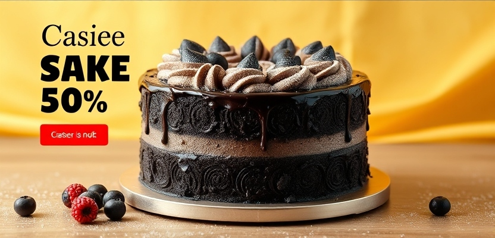

<!DOCTYPE html>
<html lang="en">
<head>
  <meta charset="UTF-8" />
  <meta name="viewport" content="width=device-width, initial-scale=1.0"/>
  <title>NexusCakes.com - README</title>
</head>
<body style="font-family: Arial, sans-serif; line-height: 1.8; margin: 40px; background-color: #f8f9fa; color: #333;">

  <h1 align="center">🍰 NexusCakes.com</h1>

  

    A simple and visually appealing cake showcase website built using HTML and CSS.
  

  

  <h2>🌐 Live Website</h2>
  

    Visit the live project here:
      
    <a href="https://nexus9601.github.io/NexusCakes.com/" target="_blank">
      https://nexus9601.github.io/NexusCakes.com/
    </a>
  

  

  <h2>📌 Project Overview</h2>
  

    <strong>NexusCakes.com</strong> is a beginner-friendly front-end web project designed to showcase different cake flavours in a clean and attractive layout.
    The website focuses on simple navigation, aesthetic design, and user-friendly browsing experience.
  

  

    Users can explore multiple cake varieties and navigate through different sections such as:
  

  <ul>
    <li>🏠 Home</li>
    <li>🎂 Cakes</li>
    <li>💖 Wishlist</li>
    <li>📦 Orders</li>
    <li>📞 Contact</li>
  </ul>

  

  <h2>🎂 Cake Varieties Available</h2>

  <ul>
    <li>Truffle Cake</li>
    <li>Black Forest Cake</li>
    <li>Butter Scotch Cake</li>
    <li>Red Velvet Cake</li>
    <li>Chocolate Cake</li>
    <li>Pineapple Cake</li>
    <li>Vanilla Cake</li>
    <li>Fruit Cake</li>
  </ul>

  

  <h2>🛠️ Technologies Used</h2>

  <ul>
    <li>HTML5</li>
    <li>CSS3</li>
  </ul>

  

  <h2>📂 Project Structure</h2>

  <pre style="background:#eee; padding:15px; border-radius:8px;">
NexusCakes.com/
│
├── index.html
├── nexuscakes.css
├── cake.jpg
└── README.html
  </pre>

  

  <h2>✨ Features</h2>

  <ul>
    <li>Responsive and clean UI design</li>
    <li>Easy navigation menu</li>
    <li>Simple and beginner-friendly code structure</li>
    <li>Beautiful cake showcase section</li>
    <li>Contact information section</li>
    <li>Attractive footer design</li>
  </ul>

  

  <h2>🚀 How to Run the Project</h2>

  <ol>
    <li>Download or clone the repository.</li>
    <li>Open the project folder.</li>
    <li>Run the <strong>index.html</strong> file in any browser.</li>
  </ol>

  

  <h2>📷 Project Preview</h2>

  

    Add your website screenshot here for better presentation.
  

  

  

  <h2>📚 Learning Outcome</h2>

  

    This project helped in understanding:
  

  <ul>
    <li>HTML page structure</li>
    <li>CSS styling techniques</li>
    <li>Navigation bar creation</li>
    <li>Image handling in web pages</li>
    <li>Basic responsive design concepts</li>
  </ul>

  

  <h2>👨‍💻 Author</h2>

  

    <strong>Kirthick S</strong> 
    B.Tech CSE (Data Science & Data Engineering) 
    Lovely Professional University
  

  

  <h2>📄 License</h2>

  

    This project is created for educational and learning purposes only.
  

    

  

    ⭐ If you like this project, consider giving it a star on GitHub!
  

</body>
</html>
